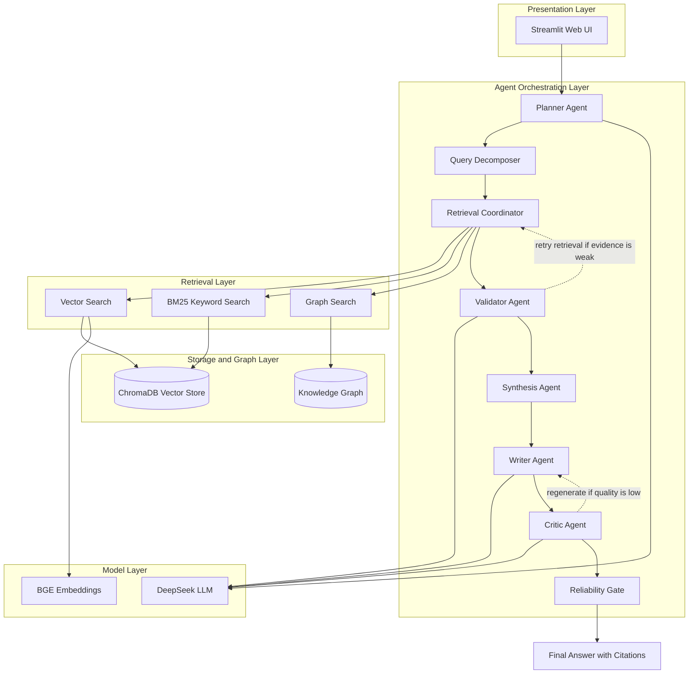
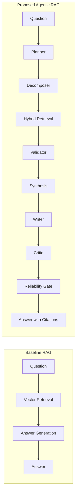

# Thesis Architecture and Innovation Points

## Figure 1: Overall System Architecture

## Figure 2: Baseline vs Proposed Pipeline

## Innovation Points

### 1. Hierarchical Multi-Agent Orchestration

The system is not a fixed retrieve-then-generate pipeline. It uses a planner, decomposer, retrieval coordinator, validator, synthesis agent, writer, critic, and reliability gate.

### 2. Hybrid Retrieval

The retrieval coordinator combines vector search, BM25 keyword retrieval, and graph search. This gives the system semantic, lexical, and relationship-based evidence channels.

### 3. Self-Reflection and Reliability Control

The validator checks evidence before writing. The critic reviews generated answers and can trigger regeneration. The reliability gate performs final grounding and citation checks.

### 4. Graph-Based Reasoning

The graph components extract entities and relationships from documents and use NetworkX graph retrieval for relationship questions.

### 5. Baseline Comparison

The project includes a vector-only baseline in `src/baselines/naive_rag.py`. The benchmark runner evaluates both baseline and proposed workflow over the same controlled documents.

## Suggested Captions

| Figure | Caption |
|--------|---------|
| Figure 3.1 | Overall architecture of the proposed Agentic RAG system |
| Figure 3.2 | Comparison between baseline RAG and the proposed hierarchical multi-agent RAG workflow |
| Figure 4.1 | General benchmark result comparison |
| Figure 4.2 | Complex reasoning benchmark result comparison |
